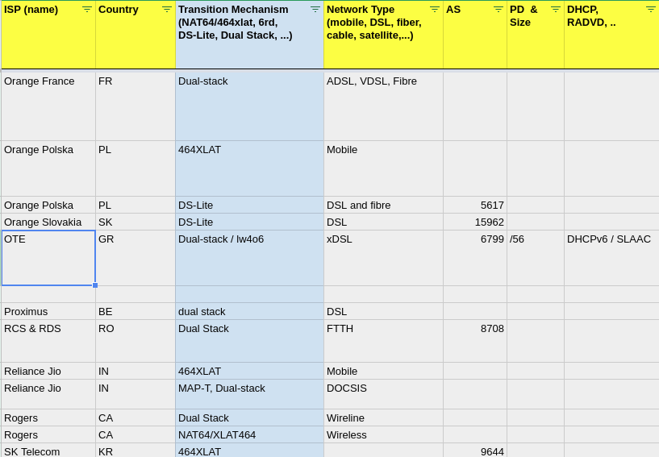

---
# State of IPv6-only in 2018
yanodd@otenet.gr

---
### What are Operators Deploying

https://docs.google.com/spreadsheets/d/1ksOoWOaRdRyjZnjLSikHf4O5L1OUTNOO_7NK9vcVApc/edit?usp=sharing

---
### Some Statistics

- DS-Lite:       11
- NAT64/464XLAT: 11 (mostly mobile)
- MAP(E/T):      3
- lw4o6:         1
- 6rd:           6

---
### Reluctancy to deploy IPv4aaS

- NAT444, plenty to go by
- IPv4 address transfers
- Fixed does not have its "464XLAT"
- Operators waiting for maturity (chicken & egg)
- no vendor push either
- Operators will deploy what's easiest and safest to deploy (see 464XLAT)
- modern transition mechs are not Gods Gifts
- IETF possibly published too many standards

---
### IETF to the rescue, maybe

- rfc8026 (Unified IPv4-in-IPv6 Softwire CPE)
- draft-ietf-v6ops-transition-ipv4aas
- draft-ietf-softwire-lightweight-4over6-deployment
- draft-ietf-v6ops-nat64-deployment
